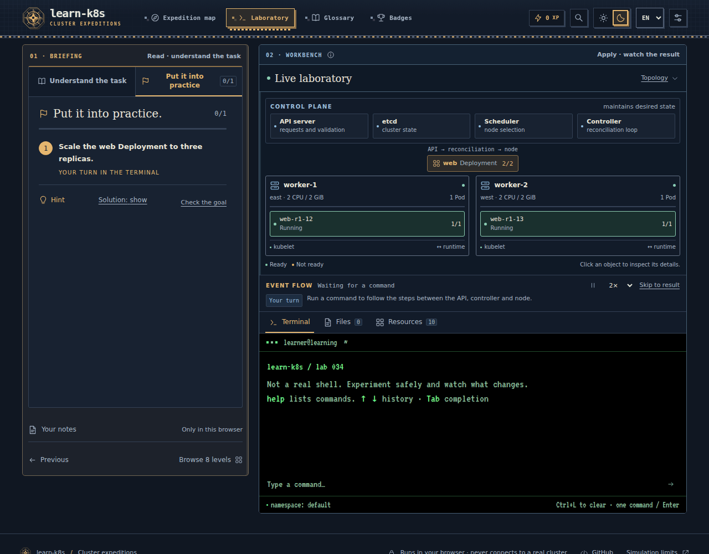

# learn-k8s

### Learn Kubernetes by doing.

Understand an idea. Run a command. Watch the cluster change.

**128 interactive labs** take you from your first container to troubleshooting a small platform—all in your browser, with no setup or account.

**[Start learning →](https://berkopan.github.io/learn-k8s/)** · [Türkçe](README.tr.md) · [Contributing](CONTRIBUTING.md)



## A little theory. A lot of practice.

- **Learn the why, then try the how.** Each lab pairs a plain-language explanation with concrete tasks, hints and a working terminal.
- **See what your commands change.** Follow Pods, controllers, Services and their relationships in an interactive cluster view. Edit YAML and inspect before/after resource changes. Explain a Pending Pod or follow a Service’s selector, readiness and endpoints.
- **Make the journey yours.** English and Turkish lessons, light and dark themes, local progress, bookmarks and notes. Resume your last lab with its terminal history and unfinished YAML, including after a page reload.

The path covers containers, Pods, Deployments, networking, configuration, storage, security, Jobs, autoscaling and Helm—ending with multi-step repair missions.

Stuck on a command? Try `help`, `help docker`, or `docker run --help`. The command reference and Tab completion are there when you need them.

## Practice beyond the guided steps

Open **Practice** from a lab or the expedition map to revisit suggested topics, try three independent incidents, or download an exercise for a real cluster. Incident numbers produce repeatable names and namespaces; you choose the investigation and repair order. Hints and worked solutions are optional; a final debrief explains the repaired fault after completion.

Labs **27, 30 and 67** require editing and saving YAML as well as fixing the live state. Labs **37, 56 and 66** include optional predictions before running a command. Later successful practice updates your learning days and unassisted record; XP is awarded only on the first completion.

For a separate **kind or minikube** cluster, download [Deployment repair](public/labs/deployment-repair.zip), [Service selector](public/labs/service-selector.zip), or [ConfigMap refresh](public/labs/configmap-refresh.zip). Each includes English/Turkish instructions, starter manifests and real verification/cleanup commands. [Package details and validation scope](public/labs/README.md).

## Run locally

Use Node.js **22.12+**.

```sh
npm ci
npm run dev
```

Run `npm test` and `npm run build` for the core checks. See [contributing](CONTRIBUTING.md) for browser tests, [architecture](docs/ARCHITECTURE.md) for the code, and [deployment](docs/DEPLOYMENT.md) for hosting.

## Open to contributions

Found a confusing explanation, a missing command or an idea for a better lab? [Open an issue](https://github.com/Berkopan/learn-k8s/issues) or send a pull request. Small improvements make the next learner’s journey better.

[MIT licensed](LICENSE). Third-party components retain their own licenses; see [notices](THIRD-PARTY-NOTICES.md).

<sub>learn-k8s is an educational simulation, not a real Kubernetes cluster or shell. It implements a documented subset of commands; no real images or infrastructure are started. Never paste real credentials. [Simulation details](docs/SIMULATOR.md).</sub>
